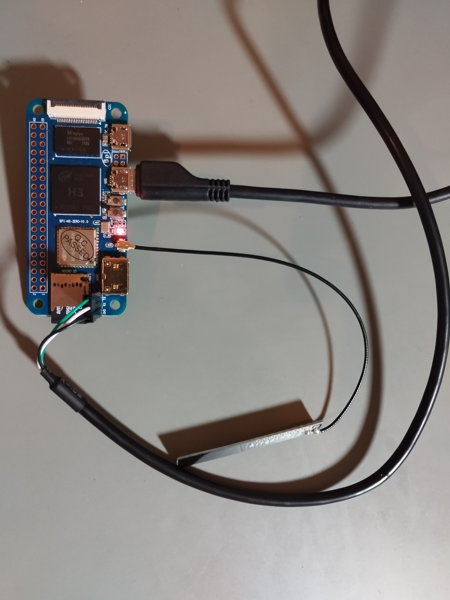

# bpi-m2-zero_wifi
This guide outlines the steps to enable Wi-Fi on a Banana Pi M2-Zero board using Buildroot.

## Precondition
You'll need a capable Linux distribution. I'm using Ubuntu 22.04 through Windows Subsystem for Linux. Install the necessary packages to prepare your system:
````shell
apt install -y git tar bzip2 make file gcc libncurses5-dev libncursesw5-Ydev cpio unzip rsync bc g++
# Additional tools might be required depending on your Linux distribution
```

## Fetching
Once your system is prepared, you can fetch and build Buildroot as a regular user (not as root). I'm using version 2023-08. If you wish to use a different release, adjust the initial lines accordingly:
```bach
cd ~    # Navigate to the home directory or any other directory of your choice
BRrelease=buildroot-2023.08-rc1
wget -c -N https://www.buildroot.org/downloads/$BRrelease.tar.gz
tar -xvf $BRrelease.tar.gz
cd $BRrelease
```

## Configuration and Compilation
To enable Wi-Fi support, some modifications are needed in the configuration. You can do this either by editing the .config file directly or using the make menuconfig command. The following configurations need to be set:

Target packages -> Hardware -> Firmware: BR2_PACKAGE_LINUX_FIRMWARE
Target packages -> Hardware -> Firmware->linux-firmware -> WiFi-firmware -> Broadcom BRCM bcm43xxx: BR2_PACKAGE_LINUX_FIRMWARE_BRCM_BCM43XXX
Target packages -> Networking applications -> wpa_supplicant: BR2_PACKAGE_WPA_SUPPLICANT
Additional drivers in the kernel need to be activated in the kernel dev configuration. The simplest way is to use a kernel fragment file:

Kernel -> Linux Kernel -> Additional configuration fragment file BR2_LINUX_KERNEL_CONFIG_FILES
set to the value 'custom/kernel-config-frag'


```console
make bananapi_m2_zero_defconfig
# Make adaptations in menuconfig as described above
mkdir custom
touch custom/kernel-config-frag
echo 'CONFIG_DEBUG_FS=y'>>custom/kernel-config-frag
echo 'CONFIG_NET=y'>>custom/kernel-config-frag
echo 'CONFIG_FW_LOADER=y'>>custom/kernel-config-frag
echo 'CONFIG_CRYPTO_SHA256=y'>>custom/kernel-config-frag
echo 'CONFIG_BRCMFMAC=m'>>custom/kernel-config-frag
echo 'CONFIG_BRCMFMAC_SDIO=y'>>custom/kernel-config-frag
echo 'CONFIG_NETDEVICES=y'>>custom/kernel-config-frag
echo 'CONFIG_ETHERNET=y'>>custom/kernel-config-frag
echo 'CONFIG_NET_VENDOR_ALACRITECH=y'>>custom/kernel-config-frag
echo 'CONFIG_NET_VENDOR_ALLWINNER=y'>>custom/kernel-config-frag
echo 'CONFIG_WLAN=y'>>custom/kernel-config-frag
echo 'CONFIG_WLAN_VENDOR_BROADCOM=y'>>custom/kernel-config-frag
make
```console
Alternatively, you can clone this Git repository:
```console
git clone https://github.com/philipphlikehw/bpi-m2-zero_wifi.git
mv bpi-m2-zero_wifi/* .
rm -r bpi-m2-zero_wifi
make
```

## Preparing HW
While the compilation is in progress, you have time to prepare the hardware. Attach a Wi-Fi antenna to the corresponding socket. I'm using the following part: [ebay link](https://www.ebay.de/itm/305052000140?hash=item4706841f8c:g:xX0AAOSwM-hdSpvg&amdata=enc%3AAQAIAAAA4Ec%2FoE4B3RXrgIDFDxCZV5NDmSckyCaFuZGAIDFQqk%2BLtvF%2BVzHLoP0conzRzSrv9GNmoWvbqaPizwiJHNe5%2BYlx3PBCmkyXMzf3xtmul%2Bt0Uao%2FRkQMDM%2BKWd2orluRx2yzmqNYTBVb3Ks5odGbMOZu6xYk5aJGSJx3cPFPMENZioKql4yoynxfEh6q7HhnqGS%2BfMOeZmX%2BTVE0eVb8QGcQUzDWa0jAOezYSZsqsfWr9jc2xzgJfK%2FlneySI%2BbYiH8QM1LquLpSrNWY0lQsZz4qg2BWjBDYitRaoXqloTeF%7Ctkp%3ABk9SR4rkwOfFYg)
Additionally, connect a UART adapter to the pin socket and connect it to the PCB. The default baud rate is set to 115200.




## Prepare SD-Card

Certainly, here's the revised version of your text with improvements in clarity, wording, and spelling:

Guide: Enabling Wi-Fi on Banana Pi M2-Zero using Buildroot
This guide outlines the steps to enable Wi-Fi on a Banana Pi M2-Zero board using Buildroot.

Prerequisites
You'll need a capable Linux distribution. I'm using Ubuntu 22.04 through Windows Subsystem for Linux. Install the necessary packages to prepare your system:

bash
Copy code
sudo apt install -y git tar bzip2 make file gcc libncurses5-dev libncursesw5-dev cpio unzip rsync bc g++
# Additional tools might be required depending on your Linux distribution
Obtaining the Sources
Once your system is prepared, you can fetch and build Buildroot as a regular user (not as root). I'm using version 2023-08. If you wish to use a different release, adjust the initial lines accordingly:

bash
Copy code
cd ~    # Navigate to the home directory or any other directory of your choice
BRrelease=buildroot-2023.08-rc1
wget -c -N https://www.buildroot.org/downloads/$BRrelease.tar.gz
tar -xvf $BRrelease.tar.gz
cd $BRrelease
Configuration and Compilation
To enable Wi-Fi support, some modifications are needed in the configuration. You can do this either by editing the .config file directly or using the make menuconfig command. The following configurations need to be set:

Target packages -> Hardware -> Firmware: BR2_PACKAGE_LINUX_FIRMWARE
Target packages -> Hardware -> Firmware->linux-firmware -> WiFi-firmware -> Broadcom BRCM bcm43xxx: BR2_PACKAGE_LINUX_FIRMWARE_BRCM_BCM43XXX
Target packages -> Networking applications -> wpa_supplicant: BR2_PACKAGE_WPA_SUPPLICANT
Additional drivers in the kernel need to be activated in the kernel dev configuration. The simplest way is to use a kernel fragment file:

Kernel -> Linux Kernel -> Additional configuration fragment file BR2_LINUX_KERNEL_CONFIG_FILES
set to the value custom/kernel-config-frag
bash
Copy code
make bananapi_m2_zero_defconfig
# Make adaptations in menuconfig as described above
mkdir custom
touch custom/kernel-config-frag
echo 'CONFIG_DEBUG_FS=y'>>custom/kernel-config-frag
echo 'CONFIG_NET=y'>>custom/kernel-config-frag
echo 'CONFIG_FW_LOADER=y'>>custom/kernel-config-frag
echo 'CONFIG_CRYPTO_SHA256=y'>>custom/kernel-config-frag
echo 'CONFIG_BRCMFMAC=m'>>custom/kernel-config-frag
echo 'CONFIG_BRCMFMAC_SDIO=y'>>custom/kernel-config-frag
echo 'CONFIG_NETDEVICES=y'>>custom/kernel-config-frag
echo 'CONFIG_ETHERNET=y'>>custom/kernel-config-frag
echo 'CONFIG_NET_VENDOR_ALACRITECH=y'>>custom/kernel-config-frag
echo 'CONFIG_NET_VENDOR_ALLWINNER=y'>>custom/kernel-config-frag
echo 'CONFIG_WLAN=y'>>custom/kernel-config-frag
echo 'CONFIG_WLAN_VENDOR_BROADCOM=y'>>custom/kernel-config-frag
make
Alternatively, you can clone this Git repository:

bash
Copy code
git clone https://github.com/philipphlikehw/bpi-m2-zero_wifi.git
mv bpi-m2-zero_wifi/* .
rm -r bpi-m2-zero_wifi
make
Preparing the Hardware
While the compilation is in progress, you have time to prepare the hardware. Attach a Wi-Fi antenna to the corresponding socket. I'm using the following part: ebay link
Additionally, connect a UART adapter to the pin socket and connect it to the PCB. The default baud rate is set to 115200.

Wireless hardware setup

Preparing the SD Card
Once the build process is successfully completed, the SD card image is located in 'output/images/sdcard.img'. Write this image to an SD card using conventional tools, such as 'Win32 Disk Imager'. Insert the written SD card into the board and power the board using USB. The default TTY is configured to use the UART on the headers. Therefore, connect a UART adapter and start communication at a baud rate of 115200.

## Booting and Login'
After a few seconds, a login prompt should appear. The login user is 'root', and no password is required.

## Load the Driver
Load the driver using the 'modprobe' command. The loading process can be automated by including it in an init script: 
```console
# modprobe brcmfmac
[   67.333595] brcmfmac: brcmf_fw_alloc_request: using brcm/brcmfmac43430-sdio for chip BCM43430/1
[   67.513865] brcmfmac: brcmf_fw_alloc_request: using brcm/brcmfmac43430-sdio for chip BCM43430/1
[   67.530610] brcmfmac: brcmf_c_preinit_dcmds: Firmware: BCM43430/1 wl0: Mar 30 2021 01:12:21 version 7.45.98.118 (7d96287 CY) FWID 01-32059766
```

## Connect to WiFi Acces Point
In the final step, you simply need to create a file with your Wi-Fi access details and set an IP address: script:
```console
# yourSSID=""
# yourpsk=""
# rm /etc/wpa_supplicant.conf
# touch /etc/wpa_supplicant.conf
# echo 'update_config=1'>>/etc/wpa_supplicant.conf
# echo 'network={'>>/etc/wpa_supplicant.conf
# echo 'ssid="'$yourSSID'"'>>/etc/wpa_supplicant.conf
# echo 'psk="'$yourpsk'"'>>/etc/wpa_supplicant.conf
# echo 'key_mgmt=WPA-PSK'>>/etc/wpa_supplicant.conf
# echo '}'>>/etc/wpa_supplicant.conf

# wpa_supplicant -i wlan0 -c /etc/wpa_supplicant.conf &
# Successfully initialized wpa_supplicant
rfkill: Cannot open RFKILL control device
wlan0: Trying to associate with SSID '....
wlan0: Associated with 38:10:d5:ce:50:53
wlan0: CTRL-EVENT-CONNECTED - Connection to 38:10:d5:ce:50:53 completed [id=0 id_str=]
wlan0: CTRL-EVENT-SUBNET-STATUS-UPDATE status=0

# ifconfig wlan0 192.168.178.111 up
# ping 192.168.178.1
PING 192.168.178.1 (192.168.178.1): 56 data bytes
64 bytes from 192.168.178.1: seq=0 ttl=64 time=19.045 ms
64 bytes from 192.168.178.1: seq=1 ttl=64 time=4.680 ms
64 bytes from 192.168.178.1: seq=2 ttl=64 time=4.684 ms
64 bytes from 192.168.178.1: seq=3 ttl=64 time=5.337 ms

```

## Auto Connect to a Wifi Access Point
Once you created the file '/etc/wpa_supplicant.conf' and tested our wifi-connection, you can automate the driver-loading, connecting, and ip-assigning by a simply entry in the file '/etc/network/interfaces'
Yust add the following content into the file:
```console
auto wlan0
iface wlan0 inet dhcp
        hostname BPI
        pre-up modprobe brcmfmac && while [ ! -e /sys/class/net/wlan0 ]; do sleep 1 && echo " ."; done && wpa_supplicant -D nl80211 -i wlan0 -c /etc/wpa_supplicant.conf -B
        post-down killall -q wpa_supplicant
        *wait-delay 15*

#
```

## Limitation
The BPI Board does not detect a WiFi-Access-Poitn at every Channel. If you have the issue with that you ssid is not detected, disable auto-channel in your router and set is to Channel 1.


